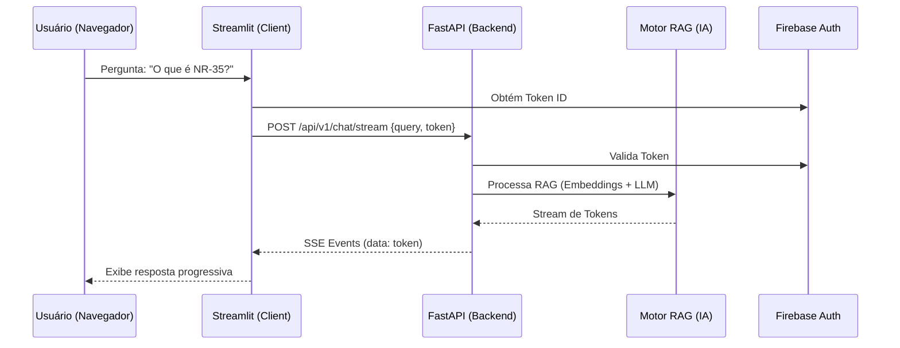

# Arquitetura de Backend FastAPI (Fase 3)

O Safety AI evoluiu de uma arquitetura monolítica no Streamlit para um modelo **desacoplado Cliente-Servidor**. Esta mudança permite que a lógica pesada de IA (RAG, Embeddings, Reranking) seja executada em um serviço independente (FastAPI), enquanto o Streamlit atua apenas como uma interface de usuário leve.

## Componentes Principais

### 1. API Backend (`src/safety_ai_app/api/`)
Um serviço FastAPI robusto que expõe as funcionalidades do Safety AI via HTTP/REST.

- **`main.py`**: Entrypoint do serviço, configurando middleware CORS e routers.
- **`routers/chat.py`**: Gerencia conversas SST. Suporta streaming de respostas via Server-Sent Events (SSE) para uma experiência de usuário fluida.
- **`routers/documents.py`**: Endpoints para geração de documentos técnicos (APR, Atas).
- **`middleware/auth.py`**: Camada de segurança que valida Tokens ID do Firebase Auth em cada requisição.
- **`deps.py`**: Gerencia o ciclo de vida do motor RAG (Singleton `NRQuestionAnswering`).

### 2. Cliente da API (`src/safety_ai_app/api_client.py`)
Uma classe utilitária usada pelo Streamlit para se comunicar com o backend.

- Encapsula chamadas `POST` e tratamento de erros.
- Gerencia o consumo de streams SSE usando `httpx`.
- Injeta automaticamente o token de autenticação do usuário.

## Fluxo de Requisição



## Benefícios da Nova Arquitetura

1.  **Escalabilidade**: O backend pode ser escalado horizontalmente (múltiplas instâncias) independentemente da interface.
2.  **Performance**: O Streamlit não precisa carregar modelos de IA pesados em memória, reduzindo o tempo de boot e consumo de recursos no frontend.
3.  **Segurança**: Proteção centralizada via Firebase Auth em nível de API.
4.  **Flexibilidade**: A mesma API pode ser consumida por outros clientes (Apps Mobile, Integrações Externas).

## Como Executar

### Localmente
A API pode ser iniciada via:
```bash
python -m safety_ai_app.api.main
```

O `server.py` foi atualizado para iniciar ambos automaticamente (Proxy + Streamlit + FastAPI).

### Produção (Cloud Run)
O Dockerfile será atualizado para suportar a execução multi-processo ou o deploy de serviços separados.
